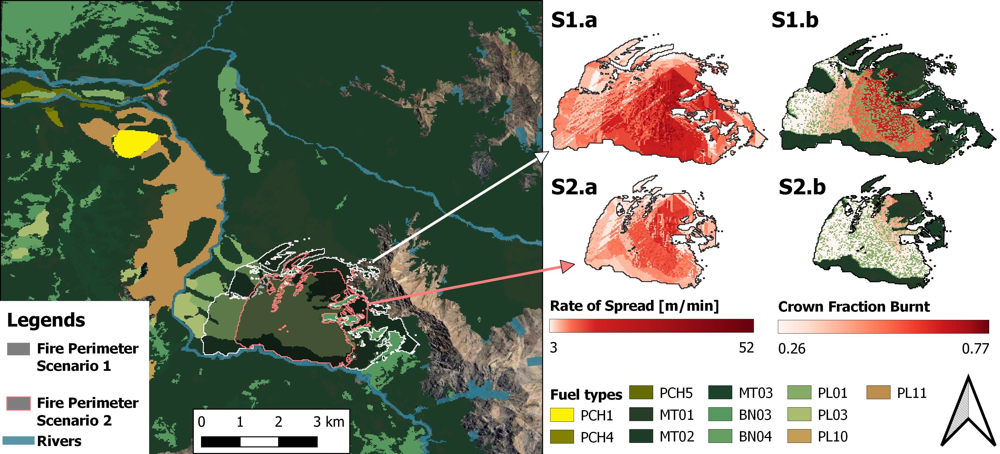

# C2FK: New Extensions of Cell2Fire Software for Fire Risk Analysis and Evaluation in Chilean Forests
## Jaime Carrasco, José Ramón González, Felipe Soto, David Palacios, Rodrigo Mahaluf, Felipe de la Barra, Carolina Espinoza, Matías Vilches, Matilde Rivas, Fernando Badilla, Horacio Gilabert, Miguel Castillo, Jorge Saavedra, Jordi Garcia-Gonzalo and Andrés Weintraub

# Disclaimer
This software is for research use only. There is no warranty of any kind; there is not even the implied warranty of fitness for use.

# Introduction
Spatial simulation of wildfires has proven to be a valuable tool for fire management, supporting both preventive planning and operational suppression. However, many of these tools are not publicly available; those that do exist often require restrictive licenses or are controlled by private companies or government agencies.  In this paper, we present an open-source computational tool capable of simulating fire growth across any region in Chile. This tool, called C2FK, can be used iteratively to produce spatially explicit simulations of fire ignitions under various scenarios, enabling the generation of burn probability maps.  C2FK builds on the Cell2Fire simulator and incorporates the Chilean fire behavior system, KITRAL. Our implementation introduces new equations for calculating the rate of spread and length-to-breadth ratio based on wind speed using an elliptical fire shape model. Additionally, it includes a crown fire behavior model. We demonstrate its capabilities by comparing results with both real and simulated wildfires using KITRAL. C2FK is cross-platform and flexible, leveraging parallel computing for fire growth modeling and supporting the creation of risk maps through large-scale stochastic simulations.

# Usage guide
### Compiling
```bash
# dependencies
sudo apt install g++-12 libboost-all-dev libtiff-dev
# or brew
brew install gcc@12 libomp boost libtiff # llvm ?

# fork & clone 
git clone git@github.com:<YOU>/C2FK.git
cd C2FK/Cell2Fire

# compile
make 
# there area other makefiles for other platforms, e.g. makefile.macos
```
Other platform details at .github/workflows/build-*.yml and makefile.*
### Running simulations
```bash
Cell2Fire --input-instance-folder /path/to/input-data --output-folder /path/to/output-results --nsims 100
```
The basic information the simulator needs is fuel and weather data. These must be located in the input instance folder, and should be named "fuels.asc" or "fuels.tif" and "Weathers.csv" respectively. Additional information such as terrain elevation, canopy bulk density, and canopy base height can also be provided. Please use the examples found under `/data` to guide your input file names.
 ### Configuring simulations
There are many command line options available to configure the simulation.
| Argument              | Type   | Function                                                                                              |
| --------------------- | ------ | ----------------------------------------------------------------------------------------------------- |
| nsims                 | int    | Number of simulations to run.                                                                         |
| cros                  | bool   | True if crown fire should be included.                                                                |
| fmc                   | int    | Used in Kitral to calculate critical intensity. Default is 100.                                       |
| nthreads              | int    | Defines the number of threads to use for simulations. Default is 1.                                   |
| seed                  | int    | Seed for the random generator.                                                                        |
| IgnitionRad           | int    | If greater than 0, picks a point on the circumference of radius = IgnitionRadius from ignition point. |
| SpreadRad             | int    | Fire spread neighborhood radius. `1` uses immediate neighbors; larger values include additional tiers. |
| nweathers             | int    | Number of weather files. Used to randomly select one.                                                 |
| CCFFactor             | float  | Weighs by the cell’s CCF when calculating crown ROS in S&B. Default is 0.                             |
| EFactor               | float  | Weighs radial distance from the ellipse center. Default is 1.0.                                       |
| BFactor               | float  | Weighs back ROS and ellipse "c". Default is 1.0.                                                      |
| FFactor               | float  | Weighs flank ROS. Default is 1.0.                                                                     |
| HFactor               | float  | Weighs head ROS. Default is 1.0.                                                                      |
| ROS-Threshold         | float  | ROS threshold for fire to spread. Default is 0.1.                                                     |
| ROS-CV                | float  | Used to calculate a random ROSRV value. Default is 0.                                                 |
| FirebreakCells        | string | Firebreak plan, sets cells as “NonBurnable”.                                                          |
| weather               | string | Options: “rows”, “constants”, “distribution”, “random”. Default is “rows”.                            |
| output-folder         | string | Directory where results will be saved.                                                                |
| input-instance-folder | string | Directory containing all required files.                                                              |
| bbo                   | bool   | True to use Black Box Optimization.                                                                   |
| final-grid            | bool   | Saves grid state at the end of the simulation.                                                        |
| grids                 | bool   | Saves forest grids during the simulation.                                                             |
| ignitions             | bool   | Reads ignition points from file or uses random ones.                                                  |
| ignitionsLog          | bool   | Saves a log of attempted ignitions.                                                                   |
| verbose               | bool   | Prints ultra-detailed log.                                                                            |
| out-cfb               | bool   | Saves crown burned fraction. Only with `--cros`.                                                      |
| out-crown             | bool   | Saves layer with crown fire cells.                                                                    |
| out-ros               | bool   | Saves ROS per cell.                                                                                   |
| out-intensity         | bool   | Saves Byram fire intensities.                                                                         |
| out-fl                | bool   | Saves flame length results. In S&B, saves surface, crown, and max.                                    |
| output-messages       | bool   | Saves file with messages (origin, destination, time, ROS).                                            |

### Spread Neighborhood Radius (`--SpreadRad`)
`--SpreadRad` controls how far a burning cell can send spread messages in one neighborhood layer definition:

- `--SpreadRad 1`: immediate neighborhood (legacy behavior)
- `--SpreadRad 2`: includes one additional ring of neighbors
- in general, interior cells have `(2n+1)^2 - 1` candidates for radius `n`

The spread model keeps the original assumption that outgoing spread from source cell `i` uses the ROS computed at source cell `i` for all candidate destination cells.


# Output examples
Most outputs are ASCII raster layers, of the same shape as the original fuels raster.

The following is the fireline intensity output for a small simulation. The cells that have 0 are cells that did not catch fire.
```bash
ncols 7
nrows 7
xllcorner 457900
yllcorner 5.7168e+06
cellsize 100
NODATA_value -9999
0 4389.03 0 0 0 0 0
0 0 17663.2 18731.9 0 4201.66 0
1711.45 0 1731.95 0 5487.64 9923.44 0
0 14655.2 6652.72 5804.41 4371.23 9348.01 0
0 9441.69 7127.24 0 0 0 0
0 0 7692.64 4389.03 3107.24 2032.65 0
0 8251.82 0 0 17663.2 18731.9 0
```

# Illustrative examples

## Fire simulation in El Portillo, with crown fire behavior.  
The fire scars generated by the simulator can be visualized with QGIS and processed to generate images such as the following example.


# About us

We are a research group that seeks solutions to complex problems arising from the terrestrial ecosystem and its natural and anthropogenic disturbances, such as wildfires.

Currently hosted at [ISCI](https://isci.cl/) offices.

Contact us on [Discord](https://discord.gg/A5jwWJKT).

Visit our [public webpage](http://www.fire2a.com/).
